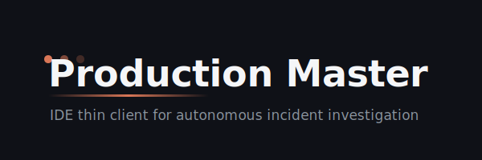
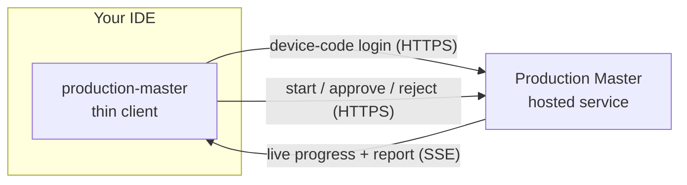

<p align="center"></p>

<p align="center">
  <a href="https://github.com/ProductionMasterAI/production-master/actions/workflows/ci.yml"></a>
  <a href="LICENSE"></a>
  <a href="https://claude.ai/code"></a>
  <a href="https://github.com/ProductionMasterAI"></a>
  <a href="CHANGELOG.md"></a>
</p>

<p align="center">
  
  
  
  
</p>

---

**Trigger, stream, and review autonomous production-incident investigations without leaving your editor.**

Production Master is a thin client for the Production Master hosted service. You point it at an incident, it starts an investigation on the service, and the results stream back into your IDE in real time. When the investigation proposes an action that changes something, you approve or reject it — nothing runs without your sign-off.

The investigation itself runs entirely on the hosted service. This repository is the thin client: it handles device-code login, starts a run, streams live progress, renders the report, and relays your approve/reject decisions. No investigation logic, model provider SDKs, or credentials for the analysis live here.

## Features

- **IDE-native investigations** — start and follow a run from Claude Code, Cursor, Codex, or OpenCode. No context switch to a separate dashboard.
- **Live streaming** — progress, findings, and the final report stream over Server-Sent Events (SSE) as the hosted service works.
- **Human-gated actions** — every proposed action that mutates a system is surfaced for explicit approval; you approve or reject before anything happens.
- **Multi-IDE support** — one thin client, registered through each editor's native extension mechanism (plugin, MCP config, or config file).

## Prerequisites

- **Node.js 22** (see [`.nvmrc`](.nvmrc) once packages land)
- **An account on the Production Master hosted service** — the client authenticates to it via device-code login.
- One of the supported editors: Claude Code, Cursor, Codex, or OpenCode.

## Quick Start

Across every editor the flow is the same: **register the client → log in with a device code → start an investigation.** Point the client at your service with `PM_SERVICE_URL` (default `https://api.productionmaster.ai`).

Build the client first (workspaces compile the host-neutral core and each adapter):

```bash
nvm use && npm ci && npm run build
```

### Claude Code

Claude Code is wired end-to-end. Install the plugin (`.claude-plugin/plugin.json` + [`commands/`](commands/), backed by [`packages/adapter-claude-code`](packages/adapter-claude-code)), then use the slash commands:

```
/plugin install production-master
/login
/investigate PROJ-1234
```

`/connect <id>`, `/update <id> <tool> [jsonArgs]`, and `/logout` are also available. Each command execs the built thin-client binary; nothing about the investigation runs locally.

### Cursor · Codex · OpenCode

> **Status:** these host adapters ([`packages/adapter-cursor`](packages/adapter-cursor), [`packages/adapter-codex`](packages/adapter-codex), [`packages/adapter-opencode`](packages/adapter-opencode)) currently ship the `HostAdapter` layer; their runnable registration entry lands in a follow-up. The config stubs — [`.cursor/mcp.json`](.cursor/mcp.json), [`.codex/config.toml`](.codex/config.toml), [`opencode.json`](opencode.json) — mark each repo as target-aware and document the registration shape. Secrets are `${ENV}` references only, never literals.

Full walkthrough: [docs/user/quick-start.md](docs/user/quick-start.md).

## Architecture

The client is a thin transport-and-render layer. All investigation logic lives on the hosted service; the client talks to it over HTTPS (control) and SSE (streaming).



The client owns four concerns: **auth** (device-code login + token storage), **MCP transport** (exposing thin-client commands to the editor), **streaming** (consuming SSE and rendering progress), and **render adapters** (per-IDE presentation). It owns none of the analysis. See [docs/engineering/architecture/overview.md](docs/engineering/architecture/overview.md).

## Documentation

| Doc | Purpose |
|-----|---------|
| [Quick Start](docs/user/quick-start.md) | Install, log in, run your first investigation |
| [Usage](docs/user/usage.md) | Common workflows — start, connect, approve/reject |
| [Commands](docs/user/reference/commands.md) | Thin-client command reference |
| [Troubleshooting](docs/user/troubleshooting.md) | Auth, service URL, and MCP registration issues |
| [Architecture](docs/engineering/architecture/overview.md) | Thin-client components and data flow |
| [ADR-001](docs/engineering/decisions/ADR-001-initial-architecture.md) | Thin client over hosted service |
| [Contributing](docs/CONTRIBUTING.md) | How to contribute |
| [Changelog](CHANGELOG.md) | Release history |

## License

MIT — see [LICENSE](LICENSE).
