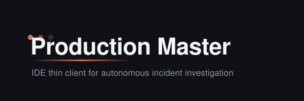
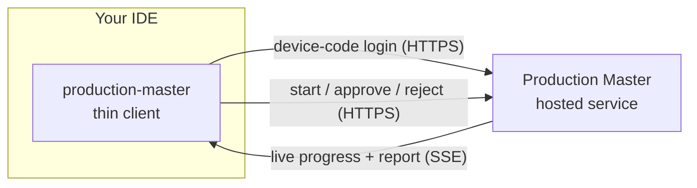

<p align="center"></p>

<p align="center">
  <a href="https://github.com/ProductionMasterAI/production-master/actions/workflows/ci.yml"></a>
  <a href="LICENSE"></a>
  <a href="https://claude.ai/code"></a>
  <a href="https://github.com/ProductionMasterAI"></a>
  <a href="CHANGELOG.md"></a>
</p>

<p align="center">
  
  
  
  
</p>

---

**Trigger, stream, and review autonomous production-incident investigations without leaving your editor.**

Production Master is a thin client for the Production Master hosted service. You point it at an incident, it starts an investigation on the service, and the results stream back into your IDE in real time. When the investigation proposes an action that changes something, you approve or reject it — nothing runs without your sign-off.

The investigation itself runs entirely on the hosted service. This repository is the thin client: it handles device-code login, starts a run, streams live progress, renders the report, and relays your approve/reject decisions. No investigation logic, model provider SDKs, or credentials for the analysis live here.

## Features

- **IDE-native investigations** — start and follow a run from Claude Code, Cursor, Codex, or OpenCode. No context switch to a separate dashboard.
- **Live streaming** — progress, findings, and the final report stream over Server-Sent Events (SSE) as the hosted service works.
- **Human-gated actions** — every proposed action that mutates a system is surfaced for explicit approval; you approve or reject before anything happens.
- **Multi-IDE support** — one thin client, registered through each editor's native extension mechanism (plugin, MCP config, or config file).

## Prerequisites

- **Node.js 22** (pinned in [`.nvmrc`](.nvmrc))
- **An account on the Production Master hosted service** — the client authenticates to it via device-code login.
- One of the supported editors: Claude Code, Cursor, Codex, or OpenCode.

## Quick Start

Across every editor the flow is the same: **register the client → log in with a device code → start an investigation.** Point the client at your service with `PM_SERVICE_URL` (default `https://api.productionmaster.dev`).

Build the client first (workspaces compile the host-neutral core and each adapter):

```bash
nvm use && npm ci && npm run build
```

### Claude Code

Claude Code is wired end-to-end. Install the plugin (`.claude-plugin/plugin.json` + [`commands/`](commands/), backed by [`packages/adapter-claude-code`](packages/adapter-claude-code)), then use the slash commands:

```
/plugin install production-master
/login
/investigate PROJ-1234
```

`/connect <id>`, `/update <id> <tool> [jsonArgs]`, and `/logout` are also available. Each command execs the built thin-client binary; nothing about the investigation runs locally.

On Claude Code 2.1.224+, the plugin can also be installed from an `archive` source — a zip fetched over HTTPS, with optional SHA-256 pinning — for machines without git or npm; see the note in the [quick start](docs/user/quick-start.md#claude-code).

### Cursor · Codex · OpenCode

Each of these editors registers the client as an MCP server that it spawns from the built binary. After `npm run build`, the config file in this repo points the editor at the client's `mcp` entry point:

| Editor   | Registration file                          | Backed by                                                |
| -------- | ------------------------------------------ | -------------------------------------------------------- |
| Cursor   | [`.cursor/mcp.json`](.cursor/mcp.json)     | [`packages/adapter-cursor`](packages/adapter-cursor)     |
| Codex    | [`.codex/config.toml`](.codex/config.toml) | [`packages/adapter-codex`](packages/adapter-codex)       |
| OpenCode | [`opencode.json`](opencode.json)           | [`packages/adapter-opencode`](packages/adapter-opencode) |

Log in once with `node packages/adapter-<editor>/dist/cli.js login`, then start investigations from the editor's own agent — it calls the client's investigation tools over MCP. Point the client at your service with `PM_SERVICE_URL` (default `https://api.productionmaster.dev`); secrets are `${ENV}` references only, never literals.

### pmctl (operator CLI)

For scripting and CI, [`packages/pmctl`](packages/pmctl) is a standalone `pmctl` binary — the
same thin client over the same BFF, without an editor. After `npm run build`:

```bash
node packages/pmctl/dist/cli.js login
node packages/pmctl/dist/cli.js start PROJ-1234 --title "..." --mode standard
node packages/pmctl/dist/cli.js status <run-id>
node packages/pmctl/dist/cli.js events <run-id> --follow
node packages/pmctl/dist/cli.js report <run-id> --format md
```

Run `node packages/pmctl/dist/cli.js --help` for the full command and flag reference. `--output json`
emits a versioned envelope (`{schema:"pmctl/v1", ok, data?, error?}`) for scripting; auth, transport,
and streaming are all reused from `@production-master/plugin-core` — `pmctl` implements no HTTP, auth,
or SSE of its own, and imports no LLM/provider SDK.

Full walkthrough: [docs/user/quick-start.md](docs/user/quick-start.md).

### Python

For scripting and CI — a pure-stdlib SDK that speaks the same BFF as the
editors, with no third-party runtime dependencies:

```bash
pip install "git+https://github.com/ProductionMasterAI/production-master.git@main#subdirectory=sdk/python"
```

```python
from production_master import Client

client = Client()                       # honours PM_SERVICE_URL
inv = client.start_investigation({"ticket": "ACME-123"})
for event in inv.stream_events():       # SSE with Last-Event-ID resume
    print(event.sequence, event.type)
print(inv.get_report(format="json"))
```

Full reference: [`sdk/python/README.md`](sdk/python/README.md).

## Architecture

The client is a thin transport-and-render layer. All investigation logic lives on the hosted service; the client talks to it over HTTPS (control) and SSE (streaming).


```mermaid
flowchart LR
    subgraph IDE["Your IDE"]
        C["production-master<br/>thin client"]
    end
    S["Production Master<br/>hosted service"]

    C -- "device-code login (HTTPS)" --> S
    C -- "start / approve / reject (HTTPS)" --> S
    S -- "live progress + report (SSE)" --> C
```

The client owns four concerns: **auth** (device-code login + token storage), **MCP transport** (exposing thin-client commands to the editor), **streaming** (consuming SSE and rendering progress), and **render adapters** (per-IDE presentation). It owns none of the analysis.

## Documentation

| Doc                                               | Purpose                                                    |
| ------------------------------------------------- | ---------------------------------------------------------- |
| [Quick Start](docs/user/quick-start.md)           | Install, log in, run your first investigation              |
| [Usage](docs/user/usage.md)                       | Common workflows — start, connect, approve/reject          |
| [Commands](docs/user/reference/commands.md)       | Thin-client command reference                              |
| [Troubleshooting](docs/user/troubleshooting.md)   | Auth, service URL, and MCP registration issues             |
| [Platform support](docs/user/platform-support.md) | Editors and versions the client is validated against       |
| [Python SDK](sdk/python/README.md)                | Scripting/CI client — install, auth, streaming, publishing |
| [Contributing](docs/CONTRIBUTING.md)              | How to contribute                                          |
| [Changelog](CHANGELOG.md)                         | Release history                                            |

## License

MIT — see [LICENSE](LICENSE).
