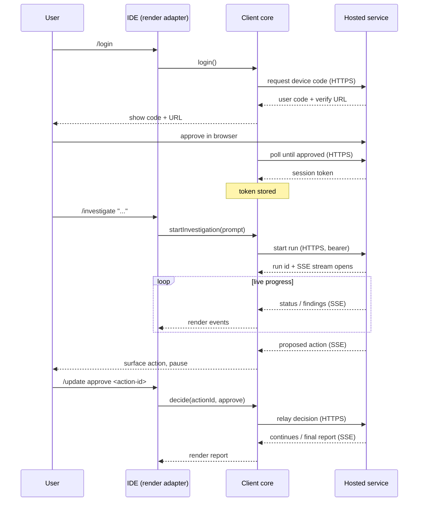

# Architecture overview

**production-master** is a thin client. It moves requests and decisions to the Production Master hosted service and renders what the service streams back. It does not investigate anything itself.

## The one decision that shapes everything

**All investigation logic is server-side.** The client contains no analysis, no model or provider SDKs, and no credentials for doing the work. It owns transport, session, and presentation — nothing more. This keeps the public client small, safe to open-source, and identical across every editor. The rationale and consequences are recorded in [ADR-001](../decisions/ADR-001-initial-architecture.md).

## Components

The client is organized around four concerns:

### 1. Auth

Handles the **device-code login** flow and token lifecycle:

- Initiates login, presents the user code + verification URL.
- Polls the service until the session is approved.
- Persists the resulting token (OS keychain or config store) and attaches it to subsequent requests.
- Resolves the target service URL (default hosted service, or a configured custom URL).

### 2. MCP transport

Exposes the thin-client commands (`/login`, `/investigate`, `/connect`, `/update`) to the editor over the Model Context Protocol. Each editor registers the same client; the transport layer is where editor calls become service requests.

### 3. Streaming

Consumes the service's **Server-Sent Events** stream for a run and turns it into incremental updates: status changes, findings, proposed actions, and the final report. Handles reconnection so a run can be re-attached with `/connect`.

### 4. Render adapters

Per-IDE presentation. The core produces a neutral event model; a thin adapter per editor (Claude Code, Cursor, Codex, OpenCode) renders it in that editor's idiom. Adding an editor means adding an adapter, not touching transport or auth.

## Data flow

Two channels: **HTTPS** for control (login, start, decisions) and **SSE** for the live downstream (progress, findings, proposed actions, report). The client never opens a channel to anything other than the hosted service.

## What lives where

| Concern | Client (this repo) | Hosted service |
|---------|:---:|:---:|
| Device-code login & token storage | ✅ | — |
| Editor command surface (MCP) | ✅ | — |
| Consuming the SSE stream, rendering | ✅ | — |
| Relaying approve/reject decisions | ✅ | — |
| Investigation logic & orchestration | — | ✅ |
| Model / provider access | — | ✅ |
| Data source access & credentials | — | ✅ |
| Executing approved actions | — | ✅ |

## Repository layout

npm workspaces under `packages/*` (populated via PRs). The intended split follows the four concerns above — a transport-agnostic core plus per-editor adapters — so that no package pulls in analysis or provider code. CI's `ip-guard` job enforces that boundary. See [Build & release](../build-and-release/README.md).
